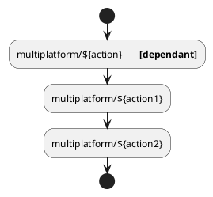
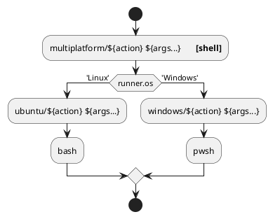
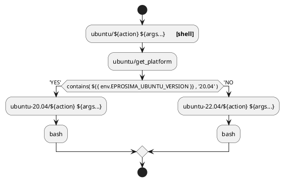

# eProsima-CI MULTIPLATFORM SUPPORT

This file contains the design decisions regarding the multiplatform support.
How it is done, why, and how it should be done for future contributions.

---

## Actions kind

Actions must belong to one and only one of these categories:

- `dependant`
  - It runs using other actions (this or other repos)
- `shell`
  - It runs using a shell (`bash`, `pwsh`, etc.)
- `full`
  - It executes a full self-contained out-of-the-box action

The idea is the following: every action that could be split in different sub-actions must be ONLY a `dependant` type, and just call actions inside it.
(see [colcon build test](../multiplatform/colcon_build_test/action.yml).
This action only calls `colcon build` and `colcon test`).

When these kind of actions arrive to a point that could not longer be split, call the `shell` respective action, which must ONLY have **1** step starting and ending a **group** that executes the expected behavior in a shell.
(see [colcon build](../ubuntu/colcon_build/action.yml).
This action calls `colcon build` in a `bash` shell).

Finally there are **full** actions that are meant to be used as a single step (or almost single, adding possible post-steps (upload artifacts)).
These actions could use `dependant` and `shell` step actions.
(see [uncrustify](../ubuntu/uncrustify/action.yml).
This action executes the whole uncrustify process).

---

## Multiplatform support

Currently the eProsima-CI repository is divided in three main folders:

- `multiplatform`
- `ubuntu`
- `windows`

All generic actions must be implemented in `multiplatform` directory following the following design:
(currently only the most used actions are implemented as this, but in the future all must follow this schema)

Thus: `multiplatform` actions should always follow one and only one of these designs:

1. call other `multiplatform` actions
2. call same action under both platforms

### Multiple OS versions support

This is also applicable to different OS versions.
For instance, a different `shell` action that must be different regarding the OS version, must call
`get_platform` action and regarding the solution, call each `shell` action under such directory.
Check [install_uncrustify](../ubuntu/install_uncrustify/action.yml) as an example.

